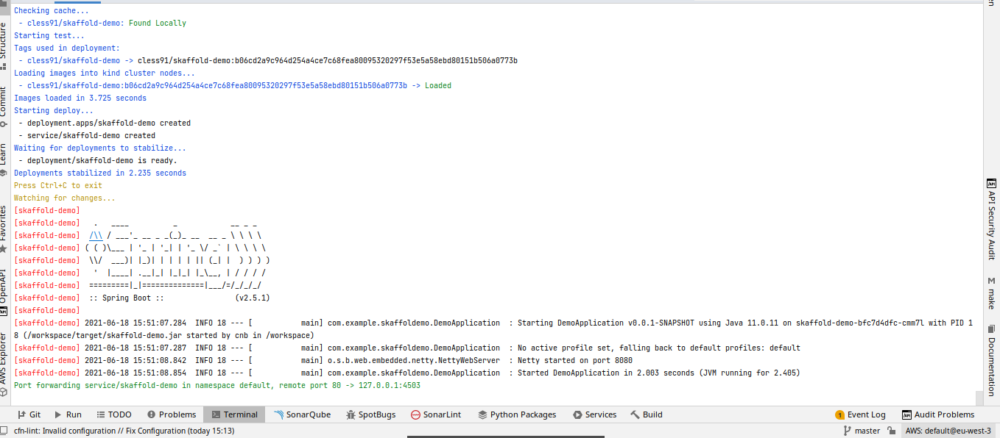

# Click Count application

[](https://travis-ci.org/xebia-france/click-count)

---

Sommaire
=================

<!--ts-->

- [Introduction, Description du travail effectué](#introduction-description-du-travail-effectué)
- [Références](#références)

---

# Introduction

Le but de ce projet est de jouer avec [Skaffold](https://github.com/GoogleContainerTools/skaffold) pour du développement autour de `Kubernetes`.

Pour se tremper les pieds, nous allons chercher à déployer en continue du code Java `SpringBoot` dans un cluster Kube local, pour ce cluster nous utilisons [Kind](https://kind.sigs.k8s.io/) dans un premier temps

# Lancement

- Création du cluster `Kind`: `kind create cluster`
- Installation de `MetalLB` dans le cluster kind pour utiliser les services de type `LoadBalancer`: suivre les instructions de  [https://kind.sigs.k8s.io/docs/user/loadbalancer/](https://kind.sigs.k8s.io/docs/user/loadbalancer/)
- Lancement de `Skaffold`: `skaffold dev --port-forward` (il utilise automatiquement le fichier `skaffold.yaml`)

Extrait de logs: 



vérifiez le service `Kubernetes` et testez-le:

```shell
05:51:11 joseph@joseph-ThinkPad-T480 skaffold-demo ±|master ✗|→ k get svc
NAME            TYPE           CLUSTER-IP      EXTERNAL-IP      PORT(S)        AGE
kubernetes      ClusterIP      10.96.0.1       <none>           443/TCP        12m
skaffold-demo   LoadBalancer   10.96.142.120   172.30.255.200   80:31228/TCP   10s
05:51:15 joseph@joseph-ThinkPad-T480 skaffold-demo ±|master ✗|→ curl 172.30.255.200 -w "\n"
hello-world 2 :: bbcb764d-59af-4fb7-b1e6-43ae2208d0ac

```


# Références

- [https://www.youtube.com/watch?v=c16oOeTfFXM](https://www.youtube.com/watch?v=c16oOeTfFXM)
- [https://piotrminkowski.com/2020/12/18/spring-boot-on-kubernetes-with-buildpacks-and-skaffold/](https://piotrminkowski.com/2020/12/18/spring-boot-on-kubernetes-with-buildpacks-and-skaffold/)
- [https://iximiuz.com/en/posts/kubernetes-kind-load-docker-image/](https://iximiuz.com/en/posts/kubernetes-kind-load-docker-image/)
- [https://kind.sigs.k8s.io/](https://kind.sigs.k8s.io/)
- [https://github.com/GoogleContainerTools/skaffold](https://github.com/GoogleContainerTools/skaffold)
- [https://skaffold.dev/](https://skaffold.dev/)